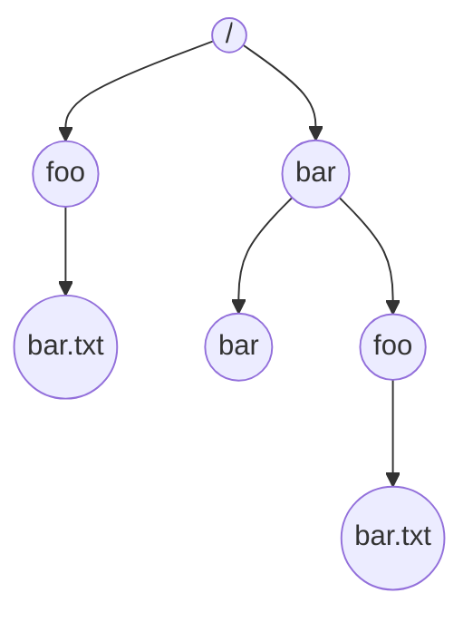

> 
>Computing Systems 
>L.EEC 
>2021/2022 
> 

# POSIX - Files and I/O 
## Introduction 
So far, we have seen and used two key virtualization concepts of modern operating systems: the process and the memory address space. Our programs have been mainly built around processes and threads where interactions and data-exchange between those occur within the virtualized memory space, which is typically volatile (e.g., mapped to the RAM memory). Thus, all of our program’s data is lost when our programs terminate, either normally or due to unexpected events such as critical errors or system power loss. Additionally, the interaction of our programs with the “outside” world has been restricted to input-output (I/O) transactions on the user’s terminal. 
 
In this laboratory work, we will see the concepts and functions provided by modern operating systems for persistent data storage (e.g., files on a hard disk drive) and I/O operations with files and devices. It is divided into 3 parts with the following objectives: 
 
 
This laboratory work will be divided into 3 parts with the following objectives: 

__Part A__ – Files. 

__Part B__ – Device driver (kernel space) - two weeks 
 
At the end there will be an __individual assessment__. 
Complementary readings: 
- [I/O Devices (OSTEP Ch. 36)](https://pages.cs.wisc.edu/~remzi/OSTEP/file-devices.pdf)
- [Files and Directories (OSTEP Ch. 39)](https://pages.cs.wisc.edu/~remzi/OSTEP/file-intro.pdf)
- [Virtual Machine Monitors (OSTEP Appendix B)](https://pages.cs.wisc.edu/~remzi/OSTEP/vmm-intro.pdf)
 
# Part A – Files 
Files are one of the key abstractions developed over time for the virtualization of storage. A file is nothing more than a simple linear array of bytes, typically on non-volatile storage, that can be read from or written to. The operating system (OS) takes the entire responsibility on knowing how these bytes are accessed and stored in a given media (e.g., magnetic hard disk) so the user does not need to know or worry about low-level details such as cylinders, tracks, sectors, and other pesky (hard-to-deal-with) details! 
 
Files are normally organized into directories, another type of an abstraction provided by the operating system. Directories are treated by most operating systems as special files whose content is essentially a list of files and some metadata (e.g., the kind of file, user permissions, etc.). Both files and directories have associated user-readable names (e.g., foo and bar.txt) and low-level name used and managed by the operating system itself (often known as its inode number). Files and directories can be organized into a hierarchical-tree-like structure - the directory tree (example of the figure below). In Unix-based systems, the root directory under which the directory structure storing all files and directories resides is named “/”. In UNIX-like operating systems, users can explore and navigate through the aforementioned file system using a terminal console and commands such as [pwd](https://man7.org/linux/man-pages/man1/pwd.1.html) , [cd](https://man7.org/linux/man-pages/man1/cd.1p.html) , and [ls](https://man7.org/linux/man-pages/man1/ls.1p.html) (try it!). 
 

__Fig.1__: An example directory tree (from [OSTEP ch 39](https://pages.cs.wisc.edu/~remzi/OSTEP/file-intro.pdf)) 

>___Foot note___ : There is a saying related to UNIX that goes “On a UNIX system, everything is a file; if something is not a file, it is a process.”. Indeed, many services/entities (e.g., sockets, peripheral devices, etc.) are modeled by the OS as a file, making these system calls also applicable. For now, we focus on regular files. 

Operating systems provide a set of system calls that allow processes to perform multiple operations on files such as opening, reading from, and writing to. For UNIX systems, the most important ones include: 

|  Function                                                         | Description                                                  |
|-------------------------------------------------------------------|--------------------------------------------------------------|
| [`open()`](https://man7.org/linux/man-pages/man2/open.2.html)     | to open/create files;                                        |
| [`read()`](https://man7.org/linux/man-pages/man2/read.2.html)     | to read from an opened file;                                 |
| [`write()`](https://man7.org/linux/man-pages/man2/write.2.html)   | to write to an opened file;                                  |
| [`fsync()`](https://man7.org/linux/man-pages/man2/fsync.2.html)   | to force-transfer (“flush”) written file data to the disk;   |
| [`lseek()`](https://man7.org/linux/man-pages/man2/lseek.2.html)   | to “navigate” (reposition) within an opened file;            |
| [`close()`](https://man7.org/linux/man-pages/man2/close.2.html)   | to close an opened file.                                     |

When a process opens an existing file or creates a new one, the OS creates an associated non-negative integer, known as file descriptor. This value corresponds to an entry of the system-wide __open file table__. Each entry in this table tracks which underlying file is being referred to, the current position (offset) within it, and other details such as whether the file is readable or writable. Each process has its own array of file descriptors and it is possible for multiple processes to work on the same file concurrently. By default, the OS opens three __file descriptors__ for a newly created process: 
- 0, for the standard input, from which the process can read from (typically the keyboard); 
- 1, for the standard output, to which the process can dump information to (typically the terminal screen);
- 2, for the standard error, to which the process can dump error messages (typically the terminal screen or a log file). 
 
## 1. Reading from a file 
The code snippet below belongs to a program that displays the file size and contents of a file whose name is passed as a command line argument. Run the program with the name of the provided sample file (fearless_knight.txt) as the argument. Carefully analyze the code and verify if the obtained file descriptor value and file offset are as expected. 
 
Tutorial Program Atp3-1 (full code @Atp3-1.c) 

```C
int main(int argc, char **argv)
{
	char *file_name;
	int file_descriptor;

	if (argc < MIN_NUMBER_OF_ARGUMENTS){
    	fprintf(stderr, "Error: usage: ./cat filename\n");
    	return -1;
	}
	
	file_name = argv[1];

	file_descriptor = open(file_name, O_RDONLY);
	if (file_descriptor == -1){
		fprintf(stderr, "Error: %s: %s\n", file_name, strerror(errno));
    	return -1;
	}
  
	fprintf(stdout, "File '%s' opened (file descriptor with value %d)\n", file_name, file_descriptor);
	fprintf(stdout, "Opened file at offset: %lld\n", lseek(file_descriptor, 0, SEEK_CUR));
	fprintf(stdout, "File size: %d\n", get_file_size(file_descriptor));
	fprintf(stdout, "File contents:\n");
	display_file_content(file_descriptor);

	close(file_descriptor);

	return 0;
}
```


>___Footnote___: Instead of memorizing the corresponding integer values, programs can use the constants `STDIN_FILENO`, `STDOUT_FILENO`, and `STDERR_FILENO` from `<unistd.h>`. 
 
 

 
<ins>__Exercise 1__</ins>: Using the available system calls to operate on files, complete the display_file_content() function so the entire content of the file “fearless_knight.txt” is displayed on the terminal screen (standard output). 

Between consecutive read calls, display the number of read bytes and the current file offset on the screen. Observe how the file offset changes each time and if it is as expected. Experiment changing the size of the buffer and how it affects the output. 

When you are done, restore the size of the buffer to 64 and delete/comment the recently introduced offset info printing. 
 
<ins>__Exercise 2__</ins>: Making use of the available system calls to operate on files, complete 
the get_file_size() function so it correctly returns the size, in bytes, of the file “fearless_knight.txt”. __Tip__: check the lseek() documentation and try to use it instead of reading through the whole file while counting read sizes. 
 
<ins>__Exercise 3__</ins>: By now, you may have noticed that the changes done during the previous exercise “broke” the correct operation of your program (contents are no longer being displayed!!!). Try to understand the issue and fix the display_file_content() function. 
 
## 2. Using files as Inter-Process Communication (IPC) 
Files are a natural mechanism of communication between processes. Given their persistence, files can hold information written by one process and read by another one at a later time. Or one can imagine several processes collaborating in the generation of data that is saved in a common file. Similarly, several processes can collaborate in reading information from a common file and processing it in parallel. In yet another dimension, files can be used to save the outputs of processes but also the configurations that are used by processes in the beginning of their operation. 
 
The code snippet below is part of an application comprising two processes: one producing random numbers and storing those in text format into a file (`numbers.txt`), and another that reads the stored numbers and splits them into two files, one for odd numbers only and another for even numbers only. In particular, the snippet belongs to the first producer process; for now, we will focus on understanding and completing the source code for the producer process only (`Atp3-2-Prod.c`). 
 
```C
void *numbersProducer(void *vargp)
{
    unsigned int number;
    char buffer[BUFFER_SIZE];

    while (1)
    {
        number = rand() % 1000;
        printf("Generated number %u\n", number);
        // Prepare data to be written to file (integer to fixed-size string format)
        snprintf(buffer, BUFFER_SIZE, "%09d", number);
        // TODO - Write to file
        sleep(1);
    }

    return NULL;
}

int main()
{
    int file_descriptor = -1;
    pthread_t tid_1;

    // TODO - Open file so that:
    // - only write-only operations are allowed
    // - file is created if not existing
    // - if file exists, append data (don't overwrite file)
    // - set permissions to 0644

    if (file_descriptor == -1)
    {
        fprintf(stderr, "Error: %s: %s\n", PRODUCER_FILE_NAME, strerror(errno));
        return -1;
    }
}
```

<ins>__Exercise 4__</ins>: Complete the `main()` and `numbersProducer()` functions so the process operates as intended. First, you should properly open the output file (use the `PRODUCER_FILE_NAME` constant as the filename) and get a valid file descriptor. Use the same file descriptor in the `numbersProducer()` thread to write the data to the file. The file should be open such that: 
- Only write operations are allowed; 
- The file should be created if not already existing; 
- If the file exists, it should not be overwritten (data should be appended); 
- Set access permissions to 0644 (you can check what this means if you want - we won’t cover access permissions in detail here). 
 
With the producer process now (hopefully!) working, let’s now have a look at the 
consumer process (code snippet below). 
 
```C
int main()
{
    pthread_t tid_1, tid_2;

    // TODO - Open the producer file so that:
    // - only read operations are allowed
    // - file is created if not existing
    // - set permissions to 0644
    // Hint: remember that both threads will read from the same
    // file and how file descriptors track the progress within
    // the file....
    if (file_descriptor1 == -1)
    {
        fprintf(stderr, "Error: %s: %s\n", PRODUCER_FILE_NAME, strerror(errno));
        return -1;
    }
    
    pthread_create(&tid_2, NULL, oddNumbersConsumer, &file_descriptor1);
    pthread_create(&tid_2, NULL, evenNumbersConsumer, &file_descriptor2);

    pthread_join(tid_1, NULL);
    pthread_join(tid_2, NULL);

    exit(0);
}
```
<ins>__Exercise 5__</ins>: Complete the functions: `main()`, `oddNumbersConsumer()` and `evenNumbersConsumer()` so the process operates as intended. An important detail: both tasks must read from the same file, concurrently, and each of them must process every stored number. That is, if the file contains the sequence `[1, 7, 6]`, both threads should read numbers `1`, `7`, and `6`, and process them accordingly. Recall how file descriptors track the progress within the file in hand, and think of a way to overcome potential issues (__Tip__: you can open a file multiple times). 
 
## 3. Locking files for consistent access 
When files are shared among multiple processes that execute concurrently, we can run into race conditions. This is very unlikely if the information in the file is accessed with a single read/write command, because of the “block access” nature of the disk. Thus, when a read operation is done it cannot be interrupted by a write operation on the same physical block. This is enforced by the disk controller. However, this is not the case when accessing information with a sequence of read/write operations. In this case, a write operation can be executed in between read operations and corrupt the information being read as a whole. 
 
> ___Footnote___: Generally, devices can be classified in character-oriented (read/write operations are done one byte at a time, e.g., serial port, a text terminal) and block-oriented (read/write operations are done in blocks at a 
time, e.g., hard disks or solid-state disks). 
 
 
 
UNIX-like operating systems define different types of locks that can be semantically attached to files to provide mutually exclusive access, i.e., like mutexes for threads. Some locks are standardized in POSIX, too, namely the so-called advisory record locks. We will now use these locks and apply them to the same producer-consumer problem as before. The locks we will use are defined in `<fcntl.h>`, namely the `struct flock`. Typically, one lock is created in each process that accesses the file. The semantics of these locks is “single writer, multiple readers”. This means that mutual exclusion is enforced between a writer process and any other process that accesses the file, be it writer or reader. On the other hand, it is not enforced when readers, only, are accessing the file. 
 
Moreover, these locks can protect the whole file or just a block of it, specified in a similar manner as the lseek() system call to navigate within the file. This is particularly useful when accessing large files to reduce blocking times. 
 
The following is an example of a record lock declared to lock a specified file, as a whole, for writing: 
```c
  #include <fcntl.h> 
  struct flock lock;  // lock is a file lock (type flock) 
   
  lock.l_type = F_WRLCK;  
    // F_WRLCK write lock, F_RDLCK read lock, F_UNLCK unlock 
  lock.l_whence = SEEK_SET; // base for offset of block to be locked 
  lock.l_start = 0;         // start of block to be locked 
  lock.l_len = 0;           // its length (0 means until end of the file) 
  lock.l_pid = getpid();    // pid of process using this lock 
```
The system call that is used to operate these locks is `fcntl()`. This is a powerful function that can be used for multiple purposes. Here we will use it with the following prototype: 
```C
  int fcntl (int fd, // file descriptor of the associated file 
             int cmd,       // action to carry out on a file lock 
             struct flock *lock);   // the lock attached to the file 
  // possible commands related to record locks: 
  // F_SETLK – try to acquire a lock, non-blocking (returns immediately) 
  // F_SETlKW – try to acquire a lock and wait if blocked, until success 
  // F_GETLK – check if a lock can be acquired 
``` 
 
 

 
Assuming that a lock was declared and initialized as above, the typical usage 
pattern is as follows: 
```C
   // specify the type of lock, for reading F_RDLCK or for writing F_WRLCK  
  lock.l_type = F_RDLCK; // specify lock for reading 
  // try acquiring the lock and, if busy, wait until lock is free (F_SETLKW) 
  if( fcntl( fd, F_SETLKW, &lock ) < 0 ) 
    exit(-1);  // error in acquiring the lock 
  // lock was acquired, you can read from the file here  
 
  // When done, you can release the lock explicitly  
  lock.l_type = F_UNLCK; 
  if (fcntl(fd, F_SETLK, &lock) < 0)   // no need to wait, command F_SETLK 
    exit(-1);  // error in releasing the lock 
  // this lock is released  
```
 
<ins>__Exercise 6__</ins>: Using the pattern above, modify the previous producer-consumer application to protect the access to the file with file locks. 
 
<ins>__Note__</ins>: File locks (struct flock and the fcntl() system call) were not made for threads. In particular, they do not provide mutual exclusion among threads. However, in the exercise of part A.2, the two threads are consumers (readers), while the producer (writer) is another process. Thus, the mutual exclusion is still enforced between the two processes. In other words, it works. Nevertheless, try modifying exercise 5 to use two consumer processes instead of two threads, and so do it properly! 
 
Check the [`fcntl()`](https://man7.org/linux/man-pages/man2/fcntl.2.html) man page
