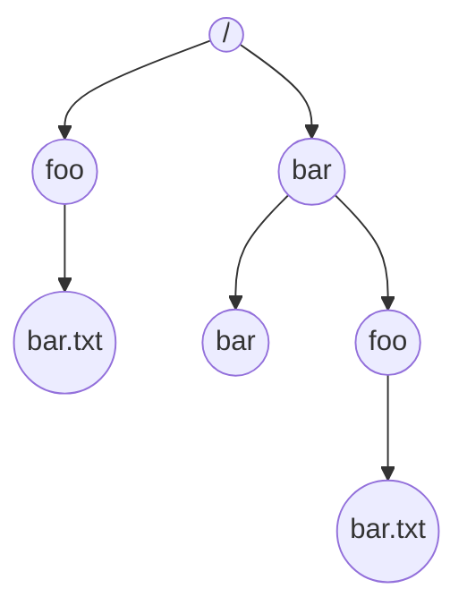

> 
>Computing Systems 
>L.EEC 
>2021/2022 
> 

# POSIX - Files and I/O 
## Introduction 
So far, we have seen and used two key virtualization concepts of modern operating systems: the process and the memory address space. Our programs have been mainly built around processes and threads where interactions and data-exchange between those occur within the virtualized memory space, which is typically volatile (e.g., mapped to the RAM memory). Thus, all of our program’s data is lost when our programs terminate, either normally or due to unexpected events such as critical errors or system power loss. Additionally, the interaction of our programs with the “outside” world has been restricted to input-output (I/O) transactions on the user’s terminal. 
 
In this laboratory work, we will see the concepts and functions provided by modern operating systems for persistent data storage (e.g., files on a hard disk drive) and I/O operations with files and devices. It is divided into 3 parts with the following objectives: 
 
 
This laboratory work will be divided into 3 parts with the following objectives: 

__Part A__ – Files. 

__Part B__ – Device driver (kernel space) - two weeks 
 
At the end there will be an __individual assessment__. 
Complementary readings: 
- [I/O Devices (OSTEP Ch. 36)](https://pages.cs.wisc.edu/~remzi/OSTEP/file-devices.pdf)
- [Files and Directories (OSTEP Ch. 39)](https://pages.cs.wisc.edu/~remzi/OSTEP/file-intro.pdf)
- [Virtual Machine Monitors (OSTEP Appendix B)](https://pages.cs.wisc.edu/~remzi/OSTEP/vmm-intro.pdf)
 
# Part A – Files 
Files are one of the key abstractions developed over time for the virtualization of storage. A file is nothing more than a simple linear array of bytes, typically on non-volatile storage, that can be read from or written to. The operating system (OS) takes the entire responsibility on knowing how these bytes are accessed and stored in a given media (e.g., magnetic hard disk) so the user does not need to know or worry about low-level details such as cylinders, tracks, sectors, and other pesky (hard-to-deal-with) details! 
 
Files are normally organized into directories, another type of an abstraction provided by the operating system. Directories are treated by most operating systems as special files whose content is essentially a list of files and some metadata (e.g., the kind of file, user permissions, etc.). Both files and directories have associated user-readable names (e.g., foo and bar.txt) and low-level name used and managed by the operating system itself (often known as its inode number). Files and directories can be organized into a hierarchical-tree-like structure - the directory tree (example of the figure below). In Unix-based systems, the root directory under which the directory structure storing all files and directories resides is named “/”. In UNIX-like operating systems, users can explore and navigate through the aforementioned file system using a terminal console and commands such as [pwd](https://man7.org/linux/man-pages/man1/pwd.1.html) , [cd](https://man7.org/linux/man-pages/man1/cd.1p.html) , and [ls](https://man7.org/linux/man-pages/man1/ls.1p.html) (try it!). 
 

__Fig.1__: An example directory tree (from [OSTEP ch 39](https://pages.cs.wisc.edu/~remzi/OSTEP/file-intro.pdf)) 

>___Foot note___ : There is a saying related to UNIX that goes “On a UNIX system, everything is a file; if something is not a file, it is a process.”. Indeed, many services/entities (e.g., sockets, peripheral devices, etc.) are modeled by the OS as a file, making these system calls also applicable. For now, we focus on regular files. 

Operating systems provide a set of system calls that allow processes to perform multiple operations on files such as opening, reading from, and writing to. For UNIX systems, the most important ones include: 

|  Function                                                         | Description                                                  |
|-------------------------------------------------------------------|--------------------------------------------------------------|
| [`open()`](https://man7.org/linux/man-pages/man2/open.2.html)     | to open/create files;                                        |
| [`read()`](https://man7.org/linux/man-pages/man2/read.2.html)     | to read from an opened file;                                 |
| [`write()`](https://man7.org/linux/man-pages/man2/write.2.html)   | to write to an opened file;                                  |
| [`fsync()`](https://man7.org/linux/man-pages/man2/fsync.2.html)   | to force-transfer (“flush”) written file data to the disk;   |
| [`lseek()`](https://man7.org/linux/man-pages/man2/lseek.2.html)   | to “navigate” (reposition) within an opened file;            |
| [`close()`](https://man7.org/linux/man-pages/man2/close.2.html)   | to close an opened file.                                     |

When a process opens an existing file or creates a new one, the OS creates an associated non-negative integer, known as file descriptor. This value corresponds to an entry of the system-wide __open file table__. Each entry in this table tracks which underlying file is being referred to, the current position (offset) within it, and other details such as whether the file is readable or writable. Each process has its own array of file descriptors and it is possible for multiple processes to work on the same file concurrently. By default, the OS opens three __file descriptors__ for a newly created process: 
- 0, for the standard input, from which the process can read from (typically the keyboard); 
- 1, for the standard output, to which the process can dump information to (typically the terminal screen);
- 2, for the standard error, to which the process can dump error messages (typically the terminal screen or a log file). 
 
## 1. Reading from a file 
The code snippet below belongs to a program that displays the file size and contents of a file whose name is passed as a command line argument. Run the program with the name of the provided sample file (fearless_knight.txt) as the argument. Carefully analyze the code and verify if the obtained file descriptor value and file offset are as expected. 
 
Tutorial Program Atp3-1 (full code @Atp3-1.c) 

```C
int main(int argc, char **argv)
{
	char *file_name;
	int file_descriptor;

	if (argc < MIN_NUMBER_OF_ARGUMENTS){
    	fprintf(stderr, "Error: usage: ./cat filename\n");
    	return -1;
	}
	
	file_name = argv[1];

	file_descriptor = open(file_name, O_RDONLY);
	if (file_descriptor == -1){
		fprintf(stderr, "Error: %s: %s\n", file_name, strerror(errno));
    	return -1;
	}
  
	fprintf(stdout, "File '%s' opened (file descriptor with value %d)\n", file_name, file_descriptor);
	fprintf(stdout, "Opened file at offset: %lld\n", lseek(file_descriptor, 0, SEEK_CUR));
	fprintf(stdout, "File size: %d\n", get_file_size(file_descriptor));
	fprintf(stdout, "File contents:\n");
	display_file_content(file_descriptor);

	close(file_descriptor);

	return 0;
}
```


>___Footnote___: Instead of memorizing the corresponding integer values, programs can use the constants `STDIN_FILENO`, `STDOUT_FILENO`, and `STDERR_FILENO` from `<unistd.h>`. 
 
 

 
<ins>__Exercise 1__</ins>: Using the available system calls to operate on files, complete the display_file_content() function so the entire content of the file “fearless_knight.txt” is displayed on the terminal screen (standard output). 

Between consecutive read calls, display the number of read bytes and the current file offset on the screen. Observe how the file offset changes each time and if it is as expected. Experiment changing the size of the buffer and how it affects the output. 

When you are done, restore the size of the buffer to 64 and delete/comment the recently introduced offset info printing. 
 
<ins>__Exercise 2__</ins>: Making use of the available system calls to operate on files, complete 
the get_file_size() function so it correctly returns the size, in bytes, of the file “fearless_knight.txt”. __Tip__: check the lseek() documentation and try to use it instead of reading through the whole file while counting read sizes. 
 
<ins>__Exercise 3__</ins>: By now, you may have noticed that the changes done during the previous exercise “broke” the correct operation of your program (contents are no longer being displayed!!!). Try to understand the issue and fix the display_file_content() function. 
 
## 2. Using files as Inter-Process Communication (IPC) 
Files are a natural mechanism of communication between processes. Given their persistence, files can hold information written by one process and read by another one at a later time. Or one can imagine several processes collaborating in the generation of data that is saved in a common file. Similarly, several processes can collaborate in reading information from a common file and processing it in parallel. In yet another dimension, files can be used to save the outputs of processes but also the configurations that are used by processes in the beginning of their operation. 
 
The code snippet below is part of an application comprising two processes: one producing random numbers and storing those in text format into a file (`numbers.txt`), and another that reads the stored numbers and splits them into two files, one for odd numbers only and another for even numbers only. In particular, the snippet belongs to the first producer process; for now, we will focus on understanding and completing the source code for the producer process only (`Atp3-2-Prod.c`). 
 
```C
void *numbersProducer(void *vargp)
{
    unsigned int number;
    char buffer[BUFFER_SIZE];

    while (1)
    {
        number = rand() % 1000;
        printf("Generated number %u\n", number);
        // Prepare data to be written to file (integer to fixed-size string format)
        snprintf(buffer, BUFFER_SIZE, "%09d", number);
        // TODO - Write to file
        sleep(1);
    }

    return NULL;
}

int main()
{
    int file_descriptor = -1;
    pthread_t tid_1;

    // TODO - Open file so that:
    // - only write-only operations are allowed
    // - file is created if not existing
    // - if file exists, append data (don't overwrite file)
    // - set permissions to 0644

    if (file_descriptor == -1)
    {
        fprintf(stderr, "Error: %s: %s\n", PRODUCER_FILE_NAME, strerror(errno));
        return -1;
    }
}
```

<ins>__Exercise 4__</ins>: Complete the `main()` and `numbersProducer()` functions so the process operates as intended. First, you should properly open the output file (use the `PRODUCER_FILE_NAME` constant as the filename) and get a valid file descriptor. Use the same file descriptor in the `numbersProducer()` thread to write the data to the file. The file should be open such that: 
- Only write operations are allowed; 
- The file should be created if not already existing; 
- If the file exists, it should not be overwritten (data should be appended); 
- Set access permissions to 0644 (you can check what this means if you want - we won’t cover access permissions in detail here). 
 
With the producer process now (hopefully!) working, let’s now have a look at the 
consumer process (code snippet below). 
 
```C
int main()
{
    pthread_t tid_1, tid_2;

    // TODO - Open the producer file so that:
    // - only read operations are allowed
    // - file is created if not existing
    // - set permissions to 0644
    // Hint: remember that both threads will read from the same
    // file and how file descriptors track the progress within
    // the file....
    if (file_descriptor1 == -1)
    {
        fprintf(stderr, "Error: %s: %s\n", PRODUCER_FILE_NAME, strerror(errno));
        return -1;
    }
    
    pthread_create(&tid_2, NULL, oddNumbersConsumer, &file_descriptor1);
    pthread_create(&tid_2, NULL, evenNumbersConsumer, &file_descriptor2);

    pthread_join(tid_1, NULL);
    pthread_join(tid_2, NULL);

    exit(0);
}
```
<ins>__Exercise 5__</ins>: Complete the functions: `main()`, `oddNumbersConsumer()` and `evenNumbersConsumer()` so the process operates as intended. An important detail: both tasks must read from the same file, concurrently, and each of them must process every stored number. That is, if the file contains the sequence `[1, 7, 6]`, both threads should read numbers `1`, `7`, and `6`, and process them accordingly. Recall how file descriptors track the progress within the file in hand, and think of a way to overcome potential issues (__Tip__: you can open a file multiple times). 
 
## 3. Locking files for consistent access 
When files are shared among multiple processes that execute concurrently, we can run into race conditions. This is very unlikely if the information in the file is accessed with a single read/write command, because of the “block access” nature of the disk. Thus, when a read operation is done it cannot be interrupted by a write operation on the same physical block. This is enforced by the disk controller. However, this is not the case when accessing information with a sequence of read/write operations. In this case, a write operation can be executed in between read operations and corrupt the information being read as a whole. 
 
> ___Footnote___: Generally, devices can be classified in character-oriented (read/write operations are done one byte at a time, e.g., serial port, a text terminal) and block-oriented (read/write operations are done in blocks at a 
time, e.g., hard disks or solid-state disks). 
 
 
 
UNIX-like operating systems define different types of locks that can be semantically attached to files to provide mutually exclusive access, i.e., like mutexes for threads. Some locks are standardized in POSIX, too, namely the so-called advisory record locks. We will now use these locks and apply them to the same producer-consumer problem as before. The locks we will use are defined in `<fcntl.h>`, namely the `struct flock`. Typically, one lock is created in each process that accesses the file. The semantics of these locks is “single writer, multiple readers”. This means that mutual exclusion is enforced between a writer process and any other process that accesses the file, be it writer or reader. On the other hand, it is not enforced when readers, only, are accessing the file. 
 
Moreover, these locks can protect the whole file or just a block of it, specified in a similar manner as the lseek() system call to navigate within the file. This is particularly useful when accessing large files to reduce blocking times. 
 
The following is an example of a record lock declared to lock a specified file, as a whole, for writing: 
```c
  #include <fcntl.h> 
  struct flock lock;  // lock is a file lock (type flock) 
   
  lock.l_type = F_WRLCK;  
    // F_WRLCK write lock, F_RDLCK read lock, F_UNLCK unlock 
  lock.l_whence = SEEK_SET; // base for offset of block to be locked 
  lock.l_start = 0;         // start of block to be locked 
  lock.l_len = 0;           // its length (0 means until end of the file) 
  lock.l_pid = getpid();    // pid of process using this lock 
```
The system call that is used to operate these locks is `fcntl()`. This is a powerful function that can be used for multiple purposes. Here we will use it with the following prototype: 
```C
  int fcntl (int fd, // file descriptor of the associated file 
             int cmd,       // action to carry out on a file lock 
             struct flock *lock);   // the lock attached to the file 
  // possible commands related to record locks: 
  // F_SETLK – try to acquire a lock, non-blocking (returns immediately) 
  // F_SETlKW – try to acquire a lock and wait if blocked, until success 
  // F_GETLK – check if a lock can be acquired 
``` 
 
 

 
Assuming that a lock was declared and initialized as above, the typical usage 
pattern is as follows: 
```C
   // specify the type of lock, for reading F_RDLCK or for writing F_WRLCK  
  lock.l_type = F_RDLCK; // specify lock for reading 
  // try acquiring the lock and, if busy, wait until lock is free (F_SETLKW) 
  if( fcntl( fd, F_SETLKW, &lock ) < 0 ) 
    exit(-1);  // error in acquiring the lock 
  // lock was acquired, you can read from the file here  
 
  // When done, you can release the lock explicitly  
  lock.l_type = F_UNLCK; 
  if (fcntl(fd, F_SETLK, &lock) < 0)   // no need to wait, command F_SETLK 
    exit(-1);  // error in releasing the lock 
  // this lock is released  
```
 
<ins>__Exercise 6__</ins>: Using the pattern above, modify the previous producer-consumer application to protect the access to the file with file locks. 
 
<ins>__Note__</ins>: File locks (struct flock and the fcntl() system call) were not made for threads. In particular, they do not provide mutual exclusion among threads. However, in the exercise of part A.2, the two threads are consumers (readers), while the producer (writer) is another process. Thus, the mutual exclusion is still enforced between the two processes. In other words, it works. Nevertheless, try modifying exercise 5 to use two consumer processes instead of two threads, and so do it properly! 
 
Check the [`fcntl()`](https://man7.org/linux/man-pages/man2/fcntl.2.html) man page


# Part B – Device driver (kernel space)  
Device  drivers  are  pieces  of  software  in  the  operating  system  that  know,  in  detail, how  a  particular  device  works  and  how  to  interact  with  it  (e.g.,  send/receive  data through a network interface card). As low-level interactions with hardware frequently require access to privileged functions, device drivers are typically run within the OS kernel address space.  
 
To implement and add device drivers to the kernel, two approaches can be followed: (i) add the device driver’s code to the kernel source tree itself, (ii) load the compiled device driver’s code to the kernel while it is running. The former approach is very rigid, requiring the whole system to be brought down and the kernel recompiled every time  a  new  piece  of  code  has  to  be  included.  The  latter  uses  __loadable  kernel modules__ (LKMs) to extend the functionality of the kernel (with the code that we want, i.e., the device driver) during runtime. LKMs can perform a variety of functions, from device and file system drivers to system calls. Indeed, we will use LKMs to develop our own device drivers through the remainder of this lab script.  
 
This part of the script is divided into two phases, each one to be executed within a class  session.  During  the  first  phase,  we  will  get  acquainted  on  how  to  program simple  LKMs,  how  to  load/unload  them,  get  acquainted  with  basic  kernel  API functions, and how to interact with the developed LKMs through user-space. For the second part, we will develop a device driver implementing a “pipe” that can be used for user processes to exchange data between themselves, emulating a communication peripheral device.  
 
__NOTE__:  All  development  and  testing  should  take  place  inside  a  Virtual  Machine  on your lab or personal computer as LKMs have free run of the system and can easily crash  it.  Lab  computers  should  already  have  the  utility  VMbox  with  a  Linux  image ready to be used.  

__IF YOU HAVE SKIPPED OVER THE PREVIOUS NOTE, READ IT NOW BEFORE CONTINUING!!!__
 
 
## 1. Building and using loadable kernel modules 
When  you  boot  your  Linux  machine  (or  VM),  a  series  of  LKMs  to  control  multiple aspects of your system are already probably loaded4 and running. You can get a list with  all  modules  by  executing  the  [`lsmod`](https://linux.die.net/man/8/lsmod)  command.  Note  that  all  commands  to manage LKMs can only be executed using elevated privileges (either by logging in as  root  or  using  the  sudo  command,  which  is  more  common,  e.g.,  sudo  lsmod). Typically, ordinary users do not have permissions to “mess” with kernel-related stuff. 
 
> The compiled LKM modules for most Linux distros are typically found under the `/lib/modules/$kernel-version$/` folder. 
 
Let’s now have a look on how to build our first LKM; a basic skeleton is shown in the following code snippet. 
 
```C
#include <linux/init.h>
#include <linux/module.h>
#include <linux/kernel.h>

MODULE_LICENSE("Dual BSD/GPL");
MODULE_AUTHOR("I'd rather not say");
MODULE_DESCRIPTION("My first LKM");
MODULE_VERSION("0:0.1");

static int hello_init(void)
{
	printk(KERN_ALERT "Hello, world\n");
	return 0;
}

static void hello_exit(void)
{
	printk(KERN_ALERT "Goodbye, cruel world\n");
}

module_init(hello_init);
module_exit(hello_exit);

```  
A  kernel  module  must  implement  at  least  two  functions:  an  initialization  function, called when the module is loaded into the kernel, and a cleanup function, called upon module unloading. In the example above, we can see the function hello_init() being declared by the pseudo-macro module_init() as the module’s initialization function. 

Similarly, function hello_exit() is declared by module_exit() as the module’s cleanup function.  Modules  can  optionally  include  miscellaneous  metadata  concerning,  for example, the type of license (macro MODULE_LICENSE) and author (MODULE_AUTHOR). Users can use the modinfo command to read this information from compiled modules.  

LKM functions are part of the kernel and as such, it is not possible to use the standard C libraries as we have been doing for our previous user-space programs. Hence, we cannot call C library functions like printf(). Instead, modules can only call functions belonging to the kernel API. In the code example above, the `printk`() kernel function replaces the functionality of printf(). You can also find kernel functions to dynamically allocate memory, write to files, etc. 
 
> __Footnote__: the information printed by `printk()` is not typically seen under the user console, but sent to a special kernel buffer that can be consulted, for example, using the dmesg command. Additionally, `printk()` defines multiple log levels (`KERN_EMERG`, `KERN_ALERT`, ..., `KERN_INFO`,  `KERN_DEBUG`) that denote the importance of the message. Consult the `printk()` documentation for more info.

Due to their nature, LKMs are compiled differently from regular user-space applications (e.g., should not be linked to libraries, must be compiled with the same options  as  the  kernel,  etc.).  We  will  not  dwell  into  details  on  this  topic.  For  each exercise, a build script (a file named Makefile) will be provided that can be used by the make utility command to build the LKM. 
 
The building process of a LKM results in a number of output files, among which, a .ko  file,  the  object  file  with  the  built  kernel  module.  Built  modules  can  be  installed (loaded) using the insmod utility command and the respective .ko file. A module can be uninstalled (unloaded) by invoking the rmmod utility with the module’s name as command argument (the module name is typically the name of the  .ko file, without the file extension). 
 
<ins>__Exercise 1__</ins> 
Download  the  hello.c  and  Makefile  files  to  your  virtual  machine  (or  shared  folder between  host  OS  and virtual  machine).  Open  the  Makefile  file.  At  the  end  you  will see the line obj-m := hello.o  ; this instructs the build tool to create several output files, including hello.ko, the object file with the hello kernel module. Now, try to build your  LKM  by  invoking  the  make  utility  command  inside  the  directory  that  contains both hello.c and Makefile files. 
 
After  successfully  building  the  module,  use  the  modinfo  utility  to  confirm  that  the metadata is as expected. Next, load the module into the kernel and confirm that it is indeed  loaded  by  executing  the  command  lsmod  |  grep  hello  (check  grep  if  you want  to  know  what this does). Verify that the “Hello, world” message has been 
logged.  When  done,  unload  the  module  and  confirm  that  the  operation  was 
successful. Confirm that the expected message is logged upon removing the module. 
 
 
## 2. Creating a device driver - the echo pseudo device driver 
After knowing the basics on how to create an LKM and use it, we will now develop a device driver that just writes to the console what is written to the pseudo device(we call this a pseudo device because it does not control any I/O device, not physical not even virtual). 
In Linux systems, devices mostly fall into one of two categories: character and block devices. Whereas the latter category allows accessing data in independent “blocks”, the  former  allows  data  to  be  retrieved  only  as  a  stream  of  characters  and  bytes. Nevertheless,  both  device  types  are  accessed  through  names  in  the  filesystem, corresponding to special files or device files6. These device files are conventionally located in the /dev directory. If you issue (try it!) the ls -l command for this directory, you  will  see  something  akin  to  the  next  image  snapshot,  where  device  files  for character and block devices are identified by a “c” and a “b” in the first column, respectively. 
 
>Recall the UNIX saying that goes “On a UNIX system, everything is a file; if something is not a file, it is a process.” 

```bash
crw-rw-rw- 1 root   root    1,  3   Feb 23 1999   null
crw------- 1 root   root   10,  1   Feb 23 1999   psaux
crw------- 1 rubini tty     4,  1   Aug 16 22:22  tty1
crw-rw-rw- 1 root   dialout 4,  64  Feb 23 11:19  ttyS0
crw-rw-rw- 1 root   dialout 4,  65  Feb 23 00:00  ttyS1
crw------- 1 root   sys     7,  1   Feb 23 1999   vcs1
crw------- 1 root   sys     7,  129 Feb 23 1999   vcsa1
crw-rw-rw- 1 root   root    1,  5   Feb 23 1999   zero

```

You can also see two numbers separated by a comma. These numbers are known as the __major__ (leftmost) and __minor__ (rightmost) device numbers, used by the kernel to identify a particular device. The major number identifies the driver associated with the  device.  In  the  snapshot  above,  devices  /dev/ttyS0  and  /dev/ttyS1  (the  virtual consoles) are both managed by driver 4. The kernel uses the major number at open time to dispatch execution to the appropriate device driver. The minor number is only used by the driver itself, not by the kernel, and is commonly used to identify a single device out of several (a device driver can control several devices, as shown in the above snapshot).  
 
> __Note__:  The  kernel  also  keeps  a  list  with  all  the  currently  assigned  major  device numbers in the __`/proc/devices`__ file; you can run the command __`cat /proc/devices`__ to see its contents. 
 
## 2.1. Allocation of a device number 
When building an LKM for a device driver, users can either request the assignment of  pre-defined  major/minor  device  numbers  (static  assignment)  or  let  the  kernel assign them dynamically. Nowadays, major device numbers are commonly assigned dynamically  to  avoid  picking  an  existing  number.  For  example,  device  drivers  for character  devices  can  request  their  device  numbers  from  the  kernel  with  the `alloc_chrdev_region()` function (defined in `<linux/fs.h>`). The function returns a kernel data structure type `dev_t` (defined in `<linux/types.h>`) that holds both numbers. The LKM can use the macros MAJOR(dev_t dev) and MINOR(dev_t dev) to obtain the major and minor numbers, respectively. Upon unloading, LKMs should release the allocated  device  numbers.  For  character  devices,  this  is  done  by  invoking  the unregister_chrdev_region() function. 
 
<ins>__Exercise 2__ </ins>
The next code snippet belongs to the source code of the device driver we are going to develop throughout the remainder of this section. 

```C
static int echo_init(void)
{
	int alloc_result = -1;
	// TODO (Exercise 2) register device driver so that:
	// - Driver name is echo 
	// - Major number is dynamically assigned
	// - Minor number starts from 0
	// - Only one device needs to be managed by the driver

	if (alloc_result < 0){
		printk(KERN_ERR "Failed to register echo device driver\n");
		return result;
	}

	// TODO (Exercise 2) print "Echo device driver registered with major number X"
	// to the kernel logging buffer so that:
	// - X is the obtained major number during registration
	// - Message printed using the informational log evel

	return 0;
} 
``` 
Download all the necessary files (echo.c and Makefile), and complete the `echo_init()` and  `echo_exit()`  functions  so  the  device  driver  is  properly  registered/unregistered, and the described log messages displayed on the kernel log buffer. Verify that you are  able  to  load  and  unload  the  module  to  the  kernel  properly,  and  that  the  major device number is freed (see the __`/proc/devices`__ file). 
 
## 2.2. Creation of the device file 

So far, we have developed a module that is able to register and obtain a valid device number from the kernel. However, after loading the module, you might have found (if not, try it now) that no device file for our echo driver has been created under the `/dev` directory!  This  is  normal,  as  the  device  file  is  not  created  automatically.  Indeed, dynamically allocating the major number has a disadvantage: you can’t create the device  files  in  advance  as  the  major  number  assigned  to  the  module  can’t  be guaranteed to always be the same. One way around this problem is to write a script that  immediately  creates7  the  required  device  files  after  loading  the  device  driver. This  is  possible  as  the  kernel  logs  all  the  assigned  major  device  numbers  in  the `/proc/devices` file; you can run the command `cat /proc/devices` to have a look into it (try it with and without your module loaded). Similarly to the compilation of kernel modules, we will not dwell on the details concerning the development of such scripts; these will also be provided to you throughout the next exercises. 
 
> Device files can be created using the `mknod` utility. 

<ins>__Exercise 3 __</ins>
Download  the  `load_driver.sh`  and  `unload_driver.sh`  scripts.  These  allow  you  to load/unload an LKM device driver and create/delete the respective device files. Both scripts  take  as  argument  the  name  of  the  module  to  load/unload  (without  the  `.ko` extension), and must be run with elevated privileges. 
 
First, make sure that the echo driver module has been unloaded since the previous exercises. Then, execute the load_driver.sh script. Verify that the module is indeed loaded and that a device file named “echo” has been created under /dev/ with the correct major and minor numbers. Afterward, run the unload_driver.sh script. Confirm that  the  module  has  been  unloaded,  the  device  file  removed,  and  that  the  major number has been released (check /proc/devices ). 
 
## 2.3. Interacting with device files 
Now that we have a device file associated with our driver, we can start interacting with it. As you may recall from Part A of this script, we have used a set of system calls such as `open()`, `close()`, `write()`, and `read()` to perform multiple operations on a file from programs living in user-space. In Linux, these same calls can be used for any kind of file, device files included! However, before these can be used, they must be  implemented  and  registered  by  the  respective  device  driver  in  kernel  space.  In the  following  section,  we  will  see  how  a  (character)  device  driver  can  register  its supported system call operations and how they are linked to its implementations by the  driver.  Afterward,  we  will  see  how  to  implement  the  most  common  operations 
using our driver: `open()`, `close()`, `write()`, and `read()`. 
 
### 2.3.1. Registering character devices and their operations 
Internally,  the  kernel  uses  structures  of  type struct ` cdev ` (`<linux/cdev.h>`)  to represent a char device and their capabilities. Therefore, before the kernel can  be able to invoke the operations of a given device, the driver must allocate and register one  (or  more)  of  these  structures.  A  driver  can  allocate  a  new  cdev  using  the `cdev_alloc()` function.  
A  cdev  structure  contains  two  members:  (i)  owner,  used  to  point  to  the  kernel module to which the driver belongs (always set with the macro THIS_MODULE ), (ii) ops, a pointer to a structure of type struct file_operations (`<linux/fs.h>`). This last structure specifies the different operations required to implement system calls such as `open()` and `read()` supported by the device driver. Essentially, it contains a set of pointers to functions defined by the driver, each of which implements the operations required  for  the  implementation  of  a  given  system  call.  You  can  find  a  detailed description of this structure in Ch. 3 of the LDD3 book, page 49 and following. 

After creating and initializing the cdev structure, the device driver must register it in the kernel by invoking the cdev_add() function. As the main purpose of this device registration is to “tell” the kernel which operations are supported by the device, it should be done within the driver’s initialization function. Similarly, the driver’s cleanup function  should  remove  from  the  system  all  cdev  structures  it  has  previously registered; this can be done by using the cdev_del() function.  
 
 

 
>Note: As soon as cdev_add returns, the device is “live” and its operations can be called  by  the  kernel.  Thus,  it  should  only  be  called  when  the  driver  is  completely initialized and ready to handle operations on the device. 
 
<ins>__Exercise 4__</ins> 
Extend the device driver’s echo_init() and echo_exit() functions so the device and its capabilities  are  registered/deregistered.  The  structure  file_operations  is  already created and filled to indicate the driver’s functions associated with each system call operation, so you need only to allocate, fill and register the cdev structure. To test if the registration was successful, load the module and execute echo 1 > /dev/echo ; you should see in the kernel log buffer the message `“echo_open(): Returning”`8  if everything is correctly done (ignore a potential error message in the user terminal). 
 
 
### 2.3.2. Implementing `open()` and `close()` 
As you may recall from Part A of this script, in Linux, a file (of any kind) must first be opened  by  an  application  before  performing  any  operations  on  it.  Likewise,  an application must close an opened file once done using it. In this section, we will learn how  to  implement  the  necessary  functionality  in  our  driver  for  the  support  of  the open() and `close()` system calls. 
 
Drivers can implement the open file operation to be invoked every time an open() system call is executed. This operation is used to perform any initialization, device-specific procedures in preparation for later operations on the device. In most drivers, the open operation should perform the following tasks: 
- Check for device-specific status and errors (e.g., device-not-ready); 
- Initialize the device if being opened for the first time; 
- Update  the  reading/writing  position,  if  necessary  (recall  file  offsets  from part⁠⁣⁢⁠ A in this project script); 
- Allocate and fill any auxiliary control data structures (e.g., state information 
 
The prototype for the open operation is: 
```C
int open(struct inode *inodep, struct file *filep); 
```
> __Note__: driver’s operation methods are invoked by the kernel upon certain events such as when a given process invokes a system call. Therefore, the arguments of these methods  are  used  by  the  kernel  to  pass  relevant  information  into  the  driver implementation. 
 
> Why do we see such a message? In summary, the executed command line command tries to write “1” to the file /dev/echo ... our device file! Recall that before being able to write to a file, it must first be opened using the system call `open()`. Well, that’s what happened here! However, since we didn’t implement the support for it in our driver, yet, ... the command stops dead there and no `write()` operation is even tried :)

The first order of business is usually to identify which device is being opened (recall that a driver can control multiple devices). As we have seen in the previous section, devices are registered using the cdev structure. However, from the open prototype we  see  that  such  structure  type  is  not  provided.  Instead,  two  new  structures  are 
available: 
- struct inode - This structure represents a file, a regular or a special file. Note that  even  though  a  given  file  may  be  opened  simultaneously  by  different processes, the kernel keeps a single struct inode. Among other members, this struct includes the member struct cdev *i_cdev that points to the cdev struct of the corresponding device. This is all you need to know for this project about the inode structure. You can find detailed information on this structure in Ch. 3 of the LDD3 book, on page 55; 
- struct  file  -  It  represents  a  file  descriptor,  which  is  returned  on  an  open system  call.  Among  other  members,  this  struct  includes  the  member  void *private_data that can be used by a device driver to maintain state information across system calls. For this project, this is all you need to know about  the  file  structure.  Detailed  description  on  this  structure  is  available  in Ch. 3 of the LDD3 book, on page 53 and following. 
 
Because some operations provided by the device driver, such as read and write, do not take as argument the address of a struct inode, but only the address of a struct file, the private_data member of the struct file is initialized during the open method with the address of the corresponding struct cdev. 
 
For the `close()` system call, device drivers implement the release operation whose prototype is as follows: 

```C
int release(struct inode *inodep, struct file *filep); 
```

Here,  the  arguments  are  the  same  as  for  the  open  operation,  and  this  operation usually undoes what the open operation has done (e.g., free data structures). Note that  not  every  invocation  of  the  `close(`  system  call  leads  to  the  invocation  of  the release operation. If you want some operation to be performed on every invocation of the `close()` system call, define a flush file operation, which is indeed invoked on every close system call. A more detailed discussion of these issues can be found in Ch. 3 of the LDD3 book, on page 59. 
 
<ins>__Exercise 5__</ins>
Complete the `echo_open()` function of the echo device driver. To that end, initialize only the private_data member of struct file to point to struct cdev, and print a short message  telling  what  was  just  done.  Also,  change  the  return  code  to  0  to  signal success. The release operation does not need any changes for now.  
 
Test the module by executing echo 1 > /dev/echo . This time, you should see in the kernel log buffer that the `echo_write()` and echo_release() functions are invoked as echo_`open()` is now functional. 
 
 
## 2.3.3. Implementing `read()` and `write()` 
A device is usually used for data input/output, therefore we would expect a device driver to provide operations supporting data transfer. In the case of the echo device driver we would like it to support: 
- write - shows in the user console whatever an application writes to the device; 
- read - returns how many characters have been written out by all applications to the device since the last time it was loaded. 
The prototypes of the aforementioned operations are as follows: 
```C
ssize_t write(struct file *filep, const char __user *buff, size_t count, loff_t *offp);
``` 
`filep` is the file pointer, buff is a buffer used to transfer data either from user space to  the  kernel  or  vice-versa,  count  is  the  size  of  the  requested  transfer,  offp  is  a pointer  to  a  long  offset  type  object  that  indicates  the  file  position  the  user  is accessing.  The  offp  argument  is  needed  because  device  drivers  are  not  aware  of the file position: it is maintained by the file system layer. Nevertheless, so that that layer can update the file structure, usually the code should update the file position at *offp accordingly after the data transfer. In the case of the echo device, seeking does not make sense, hence there is no need to keep the file position. Because the default implementation of the operation allows seeking, the open operation must invoke the function: extern int nonseekable_open(struct inode * inode, struct file * filp); This way, the kernel will prevent an lseek() system call from succeeding. In addition, the llseek operation of the struct file_operations should be set to the special helper function no_llseek . Both read and write should return the number of bytes transferred, if the operation is  successful.  Otherwise,  if  no  byte  is  successfully  transferred,  then  they  should return a negative number. However, if there is an error after successfully transferring some bytes, both should return the number of bytes transferred, and an error code in  the  following  call  of  the  function.  This  requires  the  device  driver  to  recall  the occurrence of an error from a call to the next. However, the echo device driver needs not  worry  with  partial  success  because  it  will  always  succeed  in  performing  those operations. Both in `read()` and in `write()`, the buff argument is a pointer to user space, and should not be directly dereferenced by kernel code. (An explanation of why this is so can be found  in  Ch.  3  of  the  LDD3  book,  on  pages  63  and  64.)  Instead,  you  can  use  the following kernel functions, which are defined in <asm/uaccess.h>: unsigned long copy_to_user(void __user *to,const void *from,unsigned long count); unsigned long copy_from_user(void *to, const void __user *from, unsigned long count); 

Note that the pages containing the buffer may not be in memory, and the process may  be  put  to  sleep  while  the  page  is  brought  in.  Therefore  functions  that  invoke them  must  be  reentrant  and  be  able  to  execute  concurrently  with  other  driver functions. 

Exercise 6 
Extend the device driver with the following changes: 
- Modify the device driver’s open operation to inform the kernel that the device is non seekable. 
- Complete the write file operation. It should read the data from the user space buffer  to  a  kernel  space  buffer,  and  then  print  it.  Make  sure  that  the  last character in the buffer is code 0. Do not forget to free any buffer you allocate in the kernel. 
- Implement  a  small  test  program  to  test  the  system  calls  `open()`,  `close()`, lseek(), and `write()` on the device driver. 
- Modify  the  write  operation  so  that  it  updates  the  number  of  characters  it echoes. 
- Complete the read file operation so it returns the total number of characters echoed by the device. 
- Change the test program to also test the read operation. 
 
 
3. Creating a device driver for a pipe inter-process communication 
In this section we will strengthen our knowledge of the device driver creation process by creating a pipe device, i.e., a FIFO that can be written by one process and read by  another.  Linux  already  implements  what  are  commonly  known  as  Unix  pipes represented  in  the  shell  input  with  the  character  ‘|’.  These  pipes  are  a  way  of connecting  the  output  of  a  process  to  the  input  of  another  one,  thus  allowing  their execution  in  a  chain.  These  are  extremely  useful  in  scripting  and  allow  creating powerful sequences of commands. 
 
In our case, we will design a device driver that implements the pipe functionality. In particular, it will implement a circular buffer (see the last exercise of lab assignment two)  that  can  be  opened  by  a  producer  or  a  consumer  process  and  allow  them  to exchange information.  
 
Both system calls for writing and reading should be synchronous and non-blocking, i.e., in the absence of free space (for writing) or new data (for reading) they should return immediately with the appropriate error indication. 
 
 
<ins>__Exercise 7__</ins> 
Use as base the device driver you developed in exercise 5 (should have empty read and write functions): 
- Give it the name “mypipe” and change all functions names accordingly. 
- Include “buff_helper.h” with the circular buffer definitions and functions. 
- Right  below  this  include,  declare  your  circular  buffer  reserving  space  (in mypipe_buffer).  Note  this  will  instantiate  the  buffer  as  a  global  variable within the module.   
 
```C
#define BUFFER_MAX_SIZE 10 
 
unsigned int data_space[BUFFER_MAX_SIZE]; 
circ_buff_t mypipe_buffer = {  
    data_space, 
    BUFFER_MAX_SIZE, 
    0, 
    0 
}; 
``` 
- Make  sure  all  functions  will  return  0,  instead  of  -1,  so  you  can  test  them without generating errors. 
- Replace “echo” with “mypipe” at the end of the Makefile. 
 
At this point, compile the device driver and load it. It will not do any useful function, yet, but you can test if this template is ok. After loading the device driver, try writing to it with `echo AAA > /dev/mypipe`. Similarly, try reading with `cat /dev/mypipe`. None of these operations should do anything expect printing the printk messages. 
 
If this is all ok, then let’s proceed to the next exercise, which consists in adding the necessary code to ge the desired functionality. 
 
<ins>__Exercise 8__ </ins>
Use as base the device driver you developed in exercise 5 (should have empty read and write functions): 
- Modify the device driver open function to inform the kernel that the device is non seekable similarly to Exercise 6. 
- Complete  the  read  and  write  device  functions.  Use  the  circular  buffer functions circ_buff_pop and circ_buff_push, respectively, to access the kernel FIFO buffer mypipe_buffer. Note that these functions read/write one byte  at  a time. Thus,  you  will  need  to  use  them  inside  an  adequate  loop  to transfer  from/to  the  user  buffer  (argument  of  the  device  functions).  The number  of  bytes  to  transfer  is  at  most  count  (argument  of  the  device functions). The loop should finish if the pop function returns buffer empty, or if the push function returns buffer full. 
- The return value of the read and write functions should be the actual number of  bytes  read  or  written.  If  no  byte  was  read  or  written  (FIFO  empty  or  full from the start), the functions should return an error condition (-1). 
 
Note that the circular buffer (the FIFO mypipe_buffer) is implicitly released when the module is unloaded. 
 
Similarly to the previous exercise (7), after compiling and loading, test your device writing  to  it  with echo  AAA  >  /dev/mypipe.  Then  read  from  it  with cat dev/mypipe. You should see what you wrote before. 
 
A better test consists in writing a simple program that launches a producer process and a consumer process, which communicate via this device (pretty much as if it was a file!). 
 
If you feel up to the challenge, you can further complicate the device!  
- Instead of doing a static allocation of the circular buffer as with mypipe_buffer, try doing dynamic allocation with kmalloc() when the module is installed. Don’t forget to release it when the module is removed. 
- You can verify in the open function whether the device is already open and if for writing or reading. You can force an error if more than one process tries to open the device for the same function, either writing or reading. Note that the circular buffer functions, as they are, may not work well with multiple readers or writers. 
- You can save the circular buffer in a file when the module is removed and you can  load  the  file  contents  to  the  circular  buffer  in  memory  upon  module insertion. 
- The ultimate challenge will be to do blocking read/write operations, so that the device driver waits until it can satisfy the user request (e.g., enough space in the buffer or enough data in the buffer) 
 
Note that all these suggestions are beyond the objectives of this course! 